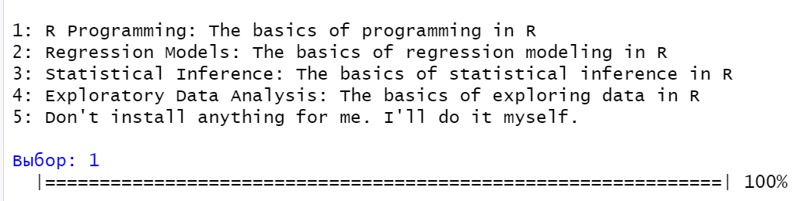

# Введение в R

## Цель работы

1.  Развить практические навыки использования языка программирования R для обработки данных
2.  Развить навыки работы в Rstudio IDE: установка пакетов работа с проектами в Rstudio настройка и работа с Git
3.  Закрепить знания базовых типов данных языка R и простейших операций с ними

## Исходные данные

1.  Программное обеспечение Windows 10 Pro
2.  Rstudio Desktop
3.  Интерпретатор языка R 4.1.1

## План

Используя программный пакет swirl, освоить базовые операции в языке программирования R.

## Шаги:

#### 1. Установить интерпретатор R


#### 2. Установить Rstudio IDE


#### 3. Установить программный пакет swirl:

`install.packages("swirl")`

#### 4. Запустить задание:

`swirl::swirl()`

#### 5. Выбрать из меню курсов 1. R Programming: The basics of programming in R



#### 6. Запустить подкурсы и выполнить Basic Building Blocks

```         

Please choose a lesson, or type 0 to return to course menu.

1: Basic Building Blocks 2: Workspace and Files
3: Sequences of Numbers 4: Vectors
5: Missing Values 6: Subsetting Vectors
7: Matrices and Data Frames 8: Logic
9: Functions 10: lapply and sapply
11: vapply and tapply 12: Looking at Data
13: Simulation 14: Dates and Times
15: Base Graphics

Выбор: 1


In its simplest form, R can be used as an interactive calculator.  Type 5 + 7 and press Enter.

5+7 
12

To assign the result of 5 + 7 to a new variable called x, you type 
x <- 5 + 7. This can be read as 'x gets 5 plus 7'. Give it a try now.

x <- 5+7

To view the contents of the variable x, just type x and press Enter. Try it now.

x 
12

Now, store the result of x - 3 in a new variable called y.

y <- x-3

What is the value of y? Type y to find out.

y 
9

The easiest way to create a vector is with the c() function, which  stands for 'concatenate' or 'combine'. To create a vector containing the numbers 1.1, 9, and 3.14, type c(1.1, 9, 3.14). Try it now and  store the result in a variable called z.

z <-c(1.1, 9, 3.14)

Anytime you have questions about a particular function, you can  access R's built-in help files via the `?` command. For example, if  you want more information on the c() function, type ?c without the  parentheses that normally follow a function name. Give it a try.

?c

Type z to view its contents. Notice that there are no commas  separating the values in the output.

z 
1.10 9.00 3.14

You can combine vectors to make a new vector. Create a new vector  that contains z, 555, then z again in that order. Don't assign this  vector to a new variable, so that we can just see the result  immediately.

c(z, 555, z) 
1.10 9.00 3.14 555.00 1.10 9.00 3.14

Numeric vectors can be used in arithmetic expressions. Type the  following to see what happens: z * 2 + 100.

z*2+100 
102.20 118.00 106.28

Take the square root of z - 1 and assign it to a new variable called  my_sqrt.

my_sqrt <- sqrt(z-1)

Before we view the contents of the my_sqrt variable, what do you  think it contains?

1: a single number (i.e a vector of length 1) 2: a vector of length 3 3: a vector of length 0 (i.e. an empty vector)

Выбор: 2

Print the contents of my_sqrt.

my_sqrt
0.3162278 2.8284271 1.4628739

Now, create a new variable called my_div that gets the value of z  divided by my_sqrt.

my_div <- z/my_sqrt

Which statement do you think is true?

1: my_div is a single number (i.e a vector of length 1) 2: The first element of my_div is equal to the first element of z divided by the first element of my_sqrt, and so on... 3: my_div is undefined

Выбор: 2

Go ahead and print the contents of my_div.

my_div 
3.478505 3.181981 2.146460

To see another example of how this vector 'recycling' works, try  adding c(1, 2, 3, 4) and c(0, 10). Don't worry about saving the  result in a new variable.

c(1, 2, 3, 4) + c(0, 10) 
1 12 3 14

Try c(1, 2, 3, 4) + c(0, 10, 100) for an example.

c(1, 2, 3, 4) + c(0, 10, 100) 
1 12 103 4 
Предупреждение: В c(1, 2, 3, 4) + c(0, 10, 100) : длина большего объекта не является произведением длины меньшего объекта

In many programming environments, the up arrow will cycle through  previous commands. Try hitting the up arrow on your keyboard until  you get to this command (z * 2 + 100), then change 100 to 1000 and  hit Enter. If the up arrow doesn't work for you, just type the  corrected command.

z*2+1000
1002.20 1018.00 1006.28

You can type the first two letters of the variable name, then hit the Tab key (possibly more than once). Most programming environments will provide a list of variables that you've created that begin with 'my'. This is called auto-completion and can be quite handy when you have  many variables in your workspace. Give it a try. (If auto-completion doesn't work for you, just type my_div and press Enter.)

my_div
3.478505 3.181981 2.146460
```

#### 7. Запустить подкурсы и выполнить Workspace and Files

```         
Please choose a lesson, or type 0 to return to course menu.

1: Basic Building Blocks 2: Workspace and Files
3: Sequences of Numbers 4: Vectors
5: Missing Values 6: Subsetting Vectors
7: Matrices and Data Frames 8: Logic
9: Functions 10: lapply and sapply
11: vapply and tapply 12: Looking at Data
13: Simulation 14: Dates and Times
15: Base Graphics

Выбор: 2

Determine which directory your R session is using as its current working directory using getwd().

getwd() 
"C:/Users/dasha/OneDrive/Документы"

List all the objects in your local workspace using ls().

ls() 
"my_div" "my_sqrt" "x" "y" "z"

Assign 9 to x using x <- 9.

x <- 9

Now take a look at objects that are in your workspace using ls().

ls()
"my_div" "my_sqrt" "x" "y" "z"

List all the files in your working directory using list.files() or  dir().

dir() 
"1" "111"
"21" "211"
"22" "3.txt"
"31" "32"
"322" "333"
"33z" "3з"
"4" "44"
"444" "5"
"desktop.ini" "IISExpress"
"img" "My Web Sites"
"Visual Studio 2022" "ааа.ofn"
"больница.owx" "ккк"
"Настраиваемые шаблоны Office" "практика 1.owx"
"резюме.jpg" "резюме.pdf"
"с2" "с22"

As we go through this lesson, you should be examining the help page for each new function. Check out the help page for list.files with the command ?list.files.

?list.files

Use the args() function to determine the arguments to list.files().

args(list.files) 

Assign the value of the current working directory to a variable called "old.dir".

old.dir <- getwd()

Use dir.create() to create a directory in the current working directory called "testdir".

dir.create("testdir")

Set your working directory to "testdir" with the setwd() command.

setwd("testdir")

Create a file in your working directory called "mytest.R" using the file.create() function.

file.create("mytest.R")
TRUE

This should be the only file in this newly created directory. Let's check this by listing all the files in the current directory.

list.files()
"mytest.R"

Check to see if "mytest.R" exists in the working directory using the file.exists() function.

file.exists("mytest.R")
TRUE

Access information about the file "mytest.R" by using file.info().

file.info("mytest.R") 
size isdir mode mtime ctime mytest.R 0 FALSE 666 2024-09-07 16:29:52 2024-09-07 16:29:52 atime exe mytest.R 2024-09-07 16:29:52 no

Change the name of the file "mytest.R" to "mytest2.R" by using file.rename().

file.rename("mytest.R", "mytest2.R")
TRUE

Make a copy of "mytest2.R" called "mytest3.R" using file.copy().

file.copy("mytest2.R", "mytest3.R")
TRUE

Provide the relative path to the file "mytest3.R" by using file.path().

file.path("mytest3.R")
"mytest3.R"

You can use file.path to construct file and directory paths that are independent of the operating system your R code is running on. Pass 'folder1' and 'folder2' as arguments to file.path to make a platform-independent pathname.

file.path("folder1", "folder2")
"folder1/folder2"

Take a look at the documentation for dir.create by entering ?dir.create . Notice the 'recursive' argument. In order to create nested directories, 'recursive' must be set to TRUE.

?dir.create

Create a directory in the current working directory called "testdir2" and a subdirectory for it called "testdir3", all in one command by using dir.create() and file.path().

dir.create(file.path('testdir2', 'testdir3'), recursive = TRUE)

Go back to your original working directory using setwd(). (Recall that we created the variable old.dir with the full path for the orginal working directory at the start of these questions.)

setwd(old.dir)
```

#### 8.Запустить подкурсы и выполнить Sequences of Numbers

```         
Please choose a lesson, or type 0 to return to course menu.

 1: Basic Building Blocks      2: Workspace and Files     
 3: Sequences of Numbers       4: Vectors                 
 5: Missing Values             6: Subsetting Vectors      
 7: Matrices and Data Frames   8: Logic                   
 9: Functions                 10: lapply and sapply       
11: vapply and tapply         12: Looking at Data         
13: Simulation                14: Dates and Times         
15: Base Graphics             

Выбор: 3

The simplest way to create a sequence of numbers in R is by using the
`:` operator. Type 1:20 to see how it works.

1:20
1  2  3  4  5  6  7  8  9 10 11 12 13 14 15 16 17 18 19 20

That gave us every integer between (and including) 1 and 20. We could
also use it to create a sequence of real numbers. For example, try
pi:10.

pi:10
3.141593 4.141593 5.141593 6.141593 7.141593 8.141593 9.141593

What happens if we do 15:1? Give it a try to find out.

15:1
15 14 13 12 11 10  9  8  7  6  5  4  3  2  1

Pull up the documentation for `:` now.

?":"

The most basic use of seq() does exactly the same thing as the `:`
operator. Try seq(1, 20) to see this.

seq(1, 20)
1  2  3  4  5  6  7  8  9 10 11 12 13 14 15 16 17 18 19 20

This gives us the same output as 1:20. However, let's say that
instead we want a vector of numbers ranging from 0 to 10, incremented
by 0.5. seq(0, 10, by=0.5) does just that. Try it out.

seq(0, 10, by=0.5)
0.0  0.5  1.0  1.5  2.0  2.5  3.0  3.5  4.0  4.5  5.0  5.5  6.0
6.5  7.0  7.5  8.0  8.5  9.0  9.5 10.0

Or maybe we don't care what the increment is and we just want a
sequence of 30 numbers between 5 and 10. seq(5, 10, length=30) does
the trick. Give it a shot now and store the result in a new variable
called my_seq.

my_seq <- seq(5, 10, length=30)

To confirm that my_seq has length 30, we can use the length()
function. Try it now.

length(my_seq)
30

There are several ways we could do this. One possibility is to
combine the `:` operator and the length() function like this:
1:length(my_seq). Give that a try.

1:length(my_seq)
1  2  3  4  5  6  7  8  9 10 11 12 13 14 15 16 17 18 19 20 21 22
23 24 25 26 27 28 29 30

Another option is to use seq(along.with = my_seq). Give that a try.

seq(along.with = my_seq)
1  2  3  4  5  6  7  8  9 10 11 12 13 14 15 16 17 18 19 20 21 22
23 24 25 26 27 28 29 30

However, as is the case with many common tasks, R has a separate
built-in function for this purpose called seq_along(). Type
seq_along(my_seq) to see it in action.

seq_along(my_seq)
1  2  3  4  5  6  7  8  9 10 11 12 13 14 15 16 17 18 19 20 21 22
23 24 25 26 27 28 29 30

If we're interested in creating a vector that contains 40 zeros, we
can use rep(0, times = 40). Try it out.

rep(0, times = 40)
0 0 0 0 0 0 0 0 0 0 0 0 0 0 0 0 0 0 0 0 0 0 0 0 0 0 0 0 0 0 0 0 0 0
0 0 0 0 0 0

If instead we want our vector to contain 10 repetitions of the vector
(0, 1, 2), we can do rep(c(0, 1, 2), times = 10). Go ahead.

rep(c(0, 1, 2), times = 10)
0 1 2 0 1 2 0 1 2 0 1 2 0 1 2 0 1 2 0 1 2 0 1 2 0 1 2 0 1 2

Finally, let's say that rather than repeating the vector (0, 1, 2)
over and over again, we want our vector to contain 10 zeros, then 10
ones, then 10 twos. We can do this with the `each` argument. Try
rep(c(0, 1, 2), each = 10).

rep(c(0, 1, 2), each = 10)
0 0 0 0 0 0 0 0 0 0 1 1 1 1 1 1 1 1 1 1 2 2 2 2 2 2 2 2 2 2
```

#### 9. Запустить подкурсы и выполнить Vectors

```         

Please choose a lesson, or type 0 to return to course menu.

 1: Basic Building Blocks      2: Workspace and Files     
 3: Sequences of Numbers       4: Vectors                 
 5: Missing Values             6: Subsetting Vectors      
 7: Matrices and Data Frames   8: Logic                   
 9: Functions                 10: lapply and sapply       
11: vapply and tapply         12: Looking at Data         
13: Simulation                14: Dates and Times         
15: Base Graphics             

Выбор: 4

First, create a numeric vector num_vect that contains the values 0.5,
55, -10, and 6.

num_vect <- c(0.5, 55, -10, 6)

Now, create a variable called tf that gets the result of num_vect <
1, which is read as 'num_vect is less than 1'.

tf <- num_vect < 1

What do you think tf will look like?

1: a vector of 4 logical values
2: a single logical value

Выбор: 1

Print the contents of tf now.

tf
TRUE FALSE  TRUE FALSE

Let's try another. Type num_vect >= 6 without assigning the result to a new variable.

num_vect >= 6
FALSE  TRUE FALSE  TRUE

(3 > 5) & (4 == 4)

1: TRUE
2: FALSE

Выбор: 2

(TRUE == TRUE) | (TRUE == FALSE)

1: FALSE
2: TRUE

Выбор: 2

((111 >= 111) | !(TRUE)) & ((4 + 1) == 5)

1: FALSE
2: TRUE

Выбор: 2

Create a character vector that contains the following words: "My",
"name", "is". Remember to enclose each word in its own set of double
quotes, so that R knows they are character strings. Store the vector
in a variable called my_char.

my_char
"My"   "name" "is"  

Type paste(my_char, collapse = " ") now. Make sure there's a space
between the double quotes in the `collapse` argument. You'll see why
in a second.

paste(my_char, collapse = " ")
"My name is"

To add (or 'concatenate') your name to the end of my_char, use the
c() function like this: c(my_char, "your_name_here"). Place your name
in double quotes where I've put "your_name_here". Try it now, storing
the result in a new variable called my_name.

c(my_char, "your_name_here")
"My"             "name"           "is"             "your_name_here"

Tack your name on to the end of the my_char vector using the c()
function.  Be sure to assign the result to a new variable called
my_name. If your name was "Swirl", you would type my_name <-
c(my_char, "Swirl").

my_name
"My"    "name"  "is"    "Swirl"

Now, use the paste() function once more to join the words in my_name
together into a single character string. Don't forget to say collapse
= " "!

paste(my_name, collapse = " ")
"My name is Swirl"

In the simplest case, we can join two character vectors that are each
of length 1 (i.e. join two words). Try paste("Hello", "world!", sep =
" "), where the `sep` argument tells R that we want to separate the
joined elements with a single space.

paste("Hello", "world!", sep = " ")
"Hello world!"

For a slightly more complicated example, we can join two vectors,
each of length 3. Use paste() to join the integer vector 1:3 with the
character vector c("X", "Y", "Z"). This time, use sep = "" to leave
no space between the joined elements.

paste(1:3, c("X", "Y", "Z"), sep = "")
"1X" "2Y" "3Z"

Vector recycling! Try paste(LETTERS, 1:4, sep = "-"), where LETTERS
is a predefined variable in R containing a character vector of all 26
letters in the English alphabet.

paste(LETTERS, 1:4, sep = "-")
"A-1" "B-2" "C-3" "D-4" "E-1" "F-2" "G-3" "H-4" "I-1" "J-2" "K-3"
"L-4" "M-1" "N-2" "O-3" "P-4" "Q-1" "R-2" "S-3" "T-4" "U-1" "V-2"
"W-3" "X-4" "Y-1" "Z-2"
```

#### 10. Запустить подкурсы и выполнить Missing Values

```         
Please choose a lesson, or type 0 to return to course menu.

 1: Basic Building Blocks      2: Workspace and Files     
 3: Sequences of Numbers       4: Vectors                 
 5: Missing Values             6: Subsetting Vectors      
 7: Matrices and Data Frames   8: Logic                   
 9: Functions                 10: lapply and sapply       
11: vapply and tapply         12: Looking at Data         
13: Simulation                14: Dates and Times         
15: Base Graphics             

Выбор: 5

Any operation involving NA generally yields NA as the result. To
illustrate, let's create a vector c(44, NA, 5, NA) and assign it to a
variable x.
x <- c(44, NA, 5, NA)

Now, let's multiply x by 3.

x*3
132  NA  15  NA

To make things a little more interesting, lets create a vector
containing 1000 draws from a standard normal distribution with y <-
rnorm(1000).

y <- rnorm(1000)

Next, let's create a vector containing 1000 NAs with z <- rep(NA,
1000).

z <- rep(NA, 1000) 

Finally, let's select 100 elements at random from these 2000 values
(combining y and z) such that we don't know how many NAs we'll wind
up with or what positions they'll occupy in our final vector --
my_data <- sample(c(y, z), 100).

my_data <- sample(c(y, z), 100)

Let's first ask the question of where our NAs are located in our
data. The is.na() function tells us whether each element of a vector
is NA. Call is.na() on my_data and assign the result to my_na.

my_na <- is.na(my_data)

Now, print my_na to see what you came up with.

> my_na
FALSE  TRUE  TRUE  TRUE  TRUE FALSE  TRUE  TRUE  TRUE FALSE FALSE
FALSE FALSE FALSE FALSE  TRUE FALSE FALSE FALSE  TRUE  TRUE  TRUE
FALSE FALSE FALSE FALSE  TRUE FALSE FALSE FALSE FALSE  TRUE  TRUE
FALSE  TRUE FALSE  TRUE  TRUE  TRUE  TRUE  TRUE  TRUE FALSE FALSE
FALSE  TRUE  TRUE FALSE  TRUE FALSE FALSE  TRUE FALSE  TRUE  TRUE
TRUE FALSE FALSE  TRUE  TRUE FALSE FALSE FALSE FALSE FALSE  TRUE
TRUE FALSE  TRUE  TRUE  TRUE FALSE FALSE FALSE FALSE  TRUE  TRUE
TRUE  TRUE  TRUE  TRUE FALSE  TRUE FALSE  TRUE FALSE  TRUE FALSE
TRUE FALSE  TRUE FALSE  TRUE  TRUE FALSE  TRUE FALSE  TRUE FALSE
TRUE

In our previous discussion of logical operators, we introduced the
`==` operator as a method of testing for equality between two
objects. So, you might think the expression my_data == NA yields the
same results as is.na(). Give it a try.

my_data == NA
NA NA NA NA NA NA NA NA NA NA NA NA NA NA NA NA NA NA NA NA NA NA
NA NA NA NA NA NA NA NA NA NA NA NA NA NA NA NA NA NA NA NA NA NA
NA NA NA NA NA NA NA NA NA NA NA NA NA NA NA NA NA NA NA NA NA NA
NA NA NA NA NA NA NA NA NA NA NA NA NA NA NA NA NA NA NA NA NA NA
NA NA NA NA NA NA NA NA NA NA NA NA

Let's give that a try here. Call the sum() function on my_na to count
the total number of TRUEs in my_na, and thus the total number of NAs
in my_data. Don't assign the result to a new variable.

sum(my_na)
51

Pretty cool, huh? Finally, let's take a look at the data to convince
ourselves that everything 'adds up'. Print my_data to the console.

my_data
1.25701270          NA          NA          NA          NA
-0.93611226          NA          NA          NA -1.13133303
0.32777580  0.98634070 -0.47325398 -1.53750343 -1.22764012
NA -0.84093387  0.53033322  2.01709923          NA
 NA          NA  0.04421904 -0.23566576  0.31147090
2.13490310          NA  0.25843333  0.20307204 -0.21504459
0.30193714          NA          NA  0.20130853          NA
2.05522281          NA          NA          NA          NA
NA          NA  0.16086570  1.13480292  0.99370752
 NA          NA -1.43359913          NA  0.13966282
0.37289632          NA  1.06560300          NA          NA
 NA  0.29055864  0.73669498          NA          NA
2.79323187  1.26857640  0.45942705  1.10242917 -1.16978385
 NA          NA -0.86683697          NA          NA
NA -0.48160146 -0.10590243  2.02879556 -0.20168997
 NA          NA          NA          NA          NA
NA -0.06429640          NA -3.08003949          NA
-0.05175526          NA  1.49609692          NA  1.42621192
NA -0.09878035          NA          NA  0.41497101
NA -0.40106451          NA  1.08939830          NA

Now that we've got NAs down pat, let's look at a second type of
missing value -- NaN, which stands for 'not a number'. To generate
NaN, try dividing (using a forward slash) 0 by 0 now.

0/0
NaN

Let's do one more, just for fun. In R, Inf stands for infinity. What
happens if you subtract Inf from Inf?

Inf-Inf
NaN
```

## Вывод

В ходе выполненной работы я развить практические навыки использования языка программирования R для обработки данных, развила навыки работы в Rstudio IDE, используя программный пакет swirl, освоила базовые операции в языке программирования R.
